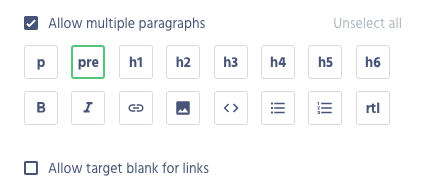

<p>{frontMatter.description}</p>

import Figure from "@site/src/components/Figure";

In Front-Commerce we expose the embed fields in two ways;

- Standalone Embed fields with an EmbedTransformer
- Embed Fields in
  [`WysiwygV2`](/docs/advanced/theme/wysiwyg#lt-wysiwygv2-gt-usage) with
  [`PrismicWysiwyg`](/docs/advanced/theme/wysiwyg-platform#prismicwysiwyg)

In this section we will cover how to implement both of these methods, and how to
implement your own custom embed fields.

:::note

you can read more about the oEmbed format and view a list of supported providers
on the [oEmbed website](https://oembed.com/).

:::

## Standalone Embed Fields

You can learn how to
[configure an embed field](https://prismic.io/docs/core-concepts/embed) in the
prismic documentation.

For this example let's say we want to create an album cover from an embed field.

### Adding an Embed Field in your server-side

First add an embed field in your schema using the
[`oEmbedContent`](https://gitlab.blackswift.cloud/front-commerce/front-commerce/-/blob/784684ce56cca69ca5c2e42d5d421a8c0b4bb9c3/modules/prismic/server/modules/prismic/core/schema.gql)
type, for example:

```graphql
type MyAlbum {
  title: String
  cover: oEmbedContent
}
```

Then you can add the
[`EmbedTransformer`](https://gitlab.blackswift.cloud/front-commerce/front-commerce/-/blob/784684ce56cca69ca5c2e42d5d421a8c0b4bb9c3/modules/prismic/server/modules/prismic/core/loaders/transformers/Embed.js)
to your album definition which will parse the embed response from Prismic as a
rich
[`oEmbedContent`](https://gitlab.blackswift.cloud/front-commerce/front-commerce/-/blob/784684ce56cca69ca5c2e42d5d421a8c0b4bb9c3/modules/prismic/server/modules/prismic/core/schema.gql)
type.

```diff
- const { TitleTransformer } = loaders.Prismic.transformers;
+ const { TitleTransformer, EmbedTransformer } = loaders.Prismic.transformers;

loaders.Prismic.defineContentTransformers("album", {
    fieldTransformers: {
      title: new TitleTransformer()
+     cover: new EmbedTransformer(),
    },
})
```

### Adding an Embed Field in your client-side

We have added a `PrismicEmbed` component to handle the embed response in you
client side.

To simplify the usage between the component and the backend data we created a
`PrismicEmbedFragment` which contains the minimum required data for the
component, for example:

```graphql
#import "theme/modules/Prismic/PrismicEmbed/PrismicEmbedFragment.gql"

fragment AlbumFragment on Album {
  title
  cover {
    ...PrismicEmbedFragment
  }
}
```

The fragment will expose several fields from the
[`oEmbedContent`](https://gitlab.blackswift.cloud/front-commerce/front-commerce/-/blob/784684ce56cca69ca5c2e42d5d421a8c0b4bb9c3/modules/prismic/server/modules/prismic/core/schema.gql)
type.

```jsx
import PrismicEmbed from "theme/modules/prismic/PrismicEmbed";

const Album = (props) => {
  return (
    <div>
      <h1>{props.title}</h1>
      <PrismicEmbed content={props.cover} />
    </div>
  );
};
```

You can override the default components for each embed type in your own theme

| Type    | Component                                                |
| ------- | -------------------------------------------------------- |
| `photo` | `theme/modules/Prismic/PrismicEmbed/Components/Photo.js` |
| `video` | `theme/modules/Prismic/PrismicEmbed/Components/Video.js` |
| `link`  | `theme/modules/Prismic/PrismicEmbed/Components/Link.js`  |
| `rich`  | `theme/modules/Prismic/PrismicEmbed/Components/Rich.js`  |

As mentioned above, the fragment only exposes the minimum required fields for
the PrismicEmbed component, if you would like to create your own custom embed
component you can refer to all the available fields on the
[`oEmbedContent`](https://gitlab.blackswift.cloud/front-commerce/front-commerce/-/blob/784684ce56cca69ca5c2e42d5d421a8c0b4bb9c3/modules/prismic/server/modules/prismic/core/schema.gql)
type.

## Wysiwyg Embed Fields

### Prerequisites

To benefit from this API, you first need to
[Configure the PrismicWysiwyg](/docs/prismic/installation#optional-configure-the-prismicwysiwyg).

### Example with PrismicWysiwyg

Update your schema to use the
[`PrismicWysiwyg`](/docs/advanced/theme/wysiwyg-platform#prismicwysiwyg) type
instead of the
[`DefaultWysiwyg`](/docs/advanced/theme/wysiwyg-platform#defaultwysiwyg).

```diff
type MyAlbum {
  title: String
  cover: oEmbedContent
-  content: DefaultWysiwyg
+  content: PrismicWysiwyg
}
```

Then use the `RichtextToWysiwygTransformer` which will transform the Prismic
Richtext to the Wysiwyg format.

```diff
- const { TitleTransformer } = loaders.Prismic.transformers;
+ const { TitleTransformer, RichtextToWysiwygTransformer } = loaders.Prismic.transformers;

loaders.Prismic.defineContentTransformers("album", {
  fieldTransformers: {
    title: new TitleTransformer()
+   content: new RichtextToWysiwygTransformer(loaders.Wysiwyg),
  },
})
```

You can then follow the same steps form
[`<WysiwygV2 /> usage`](/docs/advanced/theme/wysiwyg#lt-wysiwygv2-gt-usage) to
implement the Wysiwyg in your client-side.

### Adding additional Embed loading scripts

We have added loader functions for the following embed scripts:

- `Twitter`
- `Facebook`
- `Instagram`

You can update these loading functions or add your own by overriding the
[`theme/modules/WysiwygV2/PrismicWysiwyg/Components/EmbedScript/appEmbeds.js`](https://gitlab.blackswift.cloud/front-commerce/front-commerce/-/blob/784684ce56cca69ca5c2e42d5d421a8c0b4bb9c3/modules/prismic/web/theme/modules/WysiwygV2/PrismicWysiwyg/Components/EmbedScript/appEmbeds.js)
file.

- This file accepts a record with the key as the embed
  [provider](https://oembed.com/providers.json) (case sensitive).
- The value contains a `load` function and optionally an `src` if you would like
  to use a custom script.

```js title="theme/modules/WysiwygV2/PrismicWysiwyg/Components/EmbedScript/appEmbeds.js"
const appEmbeds = {
  // Add you custom embed script here eg:
  Facebook: {
    // this will override the `Facebook` script included by Front-Commerce
    src: "https://example.com/my-custom-facebook-script.js", // optional src (it's not recommended to change this)
    load: (ref) => {
      // this is only triggered once the script load event is fired
      if (typeof window !== "undefined" && window.FB) {
        window.FB.XFBML.parse(ref);
      }
    },
  },
};

export default appEmbeds;
```

### Custom or raw HTML embeds in Wysiwyg

To add custom or raw HTML as for EmbedFields you would need to make some
customization to the PrismicWysiwyg.

First setup your Prismic Rich Text field to allow the `pre` Tag

<Figure>



</Figure>

Then you can create a custom component for the pre tag, which will be used to
inject the html into the dom.

```jsx title="theme/modules/Wysiwygv2/PrismicWysiwyg/Components/Pre/index.js"
import React from "react";

const Pre = (props) => {
  const html = props.children[0].props.children || "";
  return html ? <div dangerouslySetInnerHTML={{ __html: html }} /> : null;
};

export default Pre;
```

Then you will need to register this component by overriding the
[`theme/modules/WysiwygV2/PrismicWysiwyg/appComponentsMap.js`](https://gitlab.blackswift.cloud/front-commerce/front-commerce/-/blob/784684ce56cca69ca5c2e42d5d421a8c0b4bb9c3/modules/prismic/web/theme/modules/WysiwygV2/PrismicWysiwyg/appComponentsMap.js)
file.

```js
import Pre from "./Components/Pre";

const appComponentsMap = {
  pre: Pre,
};

export default appComponentsMap;
```

To improve the loading of scripts you can implement your own `useEffect` to lazy
load the specific script by detecting the provider in the HTML raw text, you
might also be interested in implementing a helper like
[`dangerously-set-html-content`](https://github.com/christo-pr/dangerously-set-html-content)
which can better handle to loading of injected scripts.

:::tip

This can also be done in slices, see the
[Add Custom Embed or HTML code](https://community.prismic.io/t/add-custom-embed-or-html-code/5455)
article for more information.

:::
