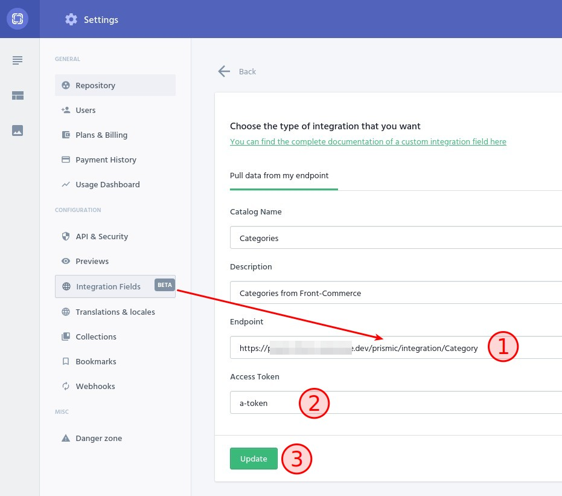
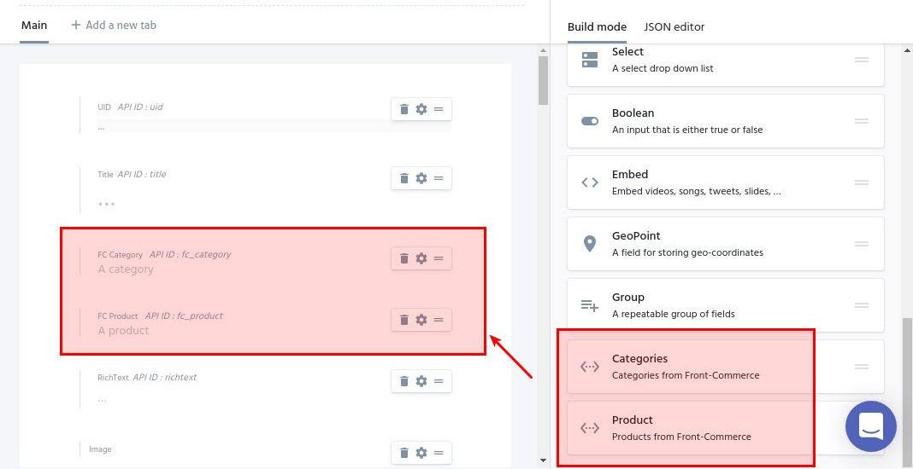
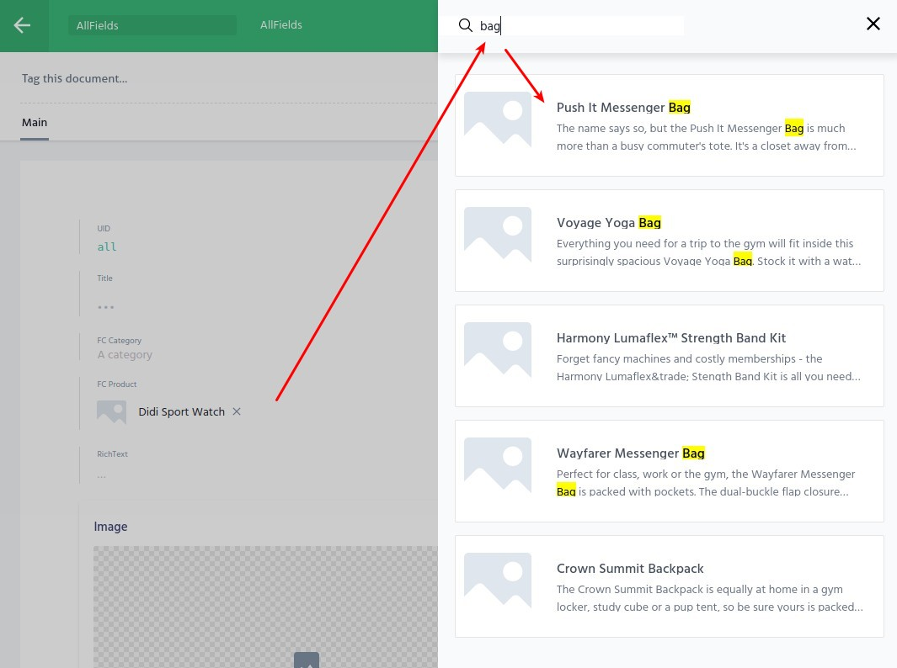

<p>{frontMatter.description}</p>

import BrowserWindow from "@site/src/components/BrowserWindow";

**[Integration fields](https://prismic.io/feature/integration-field) enable
Content managers to build a landing page by selecting Products retrieved from
your eCommerce backend without leaving the writing room**. As a developer, you
can seamlessly access the related Product data in GraphQL so that you can
leverage and reuse existing GraphQL fragments and UI components.

If this is relevant for your project, follow instructions in this page to learn
how you can create Integration fields that works with your existing
Front-Commerce application and data.

## Overview

Front-Commerce currently support Integration fields in a "Pull" mode. Here is
how it works:

1. [Developers register Integration fields in Front-Commerce](#register-integration-fields-in-front-commerce)
   for the data to expose to Prismic (with code)
1. [Configure the Integration field in Prismic](#configure-integration-fields-in-prismic)
1. Prismic will regularly pull data from a Front-Commerce read API endpoint
1. [Add these fields to custom types or Slices](#update-your-types-and-data-in-prismic)
   so Content managers will see up-to-date data in the writing room and could
   select elements made available by Front-Commerce
1. [Developers implement Prismic requests that know how to transform values from an integration field](#expose-data-in-your-graphql-schema)
   into rich data from their application (with code)
1. Frontend developers can build pages by requesting data from GraphQL as usual.
   There is no difference in data that comes from Prismic or the eCommerce
   platform.

This allows to design rich custom content types that will mix and match data
from several datasources **without introducing complexity for your frontend.**

## Register Integration fields in Front-Commerce

Registering a new Integration field allows to expose custom data in an API that
can be used by Prismic. Front-Commerce's Prismic module provides a generic way
to register Integration fields.

See the [Implementations](#implementations) section to learn more about existing
implementations.

:::note

In this example, we will use the
[`SitemapableIntegrationField`](#sitemapableintegrationfield) implementation for
more concise examples. Keep in mind that any `IntegrationField` implementation
can be registered in a similar way.

:::

To register a new Integration field, you must use the
`loaders.Prismic.registerIntegrationField()` method of the Prismic loader. You
can then provide a name that will identify it across Front-Commerce and an
implementation.

It can be done from
[a GraphQL module `contextEnhancer`](/docs/reference/graphql-module-definition#contextenhancer-optional)
as in the example below:

```js
export default {
  // […]
  dependencies: [
    "Prismic/Core",
    "Magento2/Catalog/Categories",
    "Magento2/Catalog/Products",
  ],
  contextEnhancer: ({ loaders }) => {
    const { SitemapableIntegrationField } = loaders.Prismic.integrationFields;

    loaders.Prismic.registerIntegrationField(
      "Category", // <- integration field identifier
      new SitemapableIntegrationField("Category", loaders.Sitemap, ({ id }) => {
        return loaders.Category.load(id);
      })
    );
    loaders.Prismic.registerIntegrationField(
      "Product",
      new SitemapableIntegrationField("Product", loaders.Sitemap, ({ id }) => {
        // The SitemapableIntegrationField tries to guess what the id is (in this case, the SKU is used)
        return loaders.Product.load(id);
      })
    );

    return {};
  },
};
```

When Integration fields have been registered, Front-Commerce will expose an API
endpoint for each of them at the `/prismic/integration/{name}` URL. Examples:

- http://localhost:4000/prismic/integration/Category
- http://localhost:4000/prismic/integration/Product

This API is protected with a security token defined in the
`FRONT_COMMERCE_PRISMIC_WEBHOOK_SECRET` environment variable. To test it, you
can run the following `curl` commands:

```shell
curl --user 'a-secret-defined-in-webhook-configuration:' http://localhost:4000/prismic/integration/Product
curl --user 'a-secret-defined-in-webhook-configuration:' http://localhost:4000/prismic/integration/Product?page=2
```

You must see a paginated JSON description of your data matching
[Prismic's Custom API Format](https://prismic.io/docs/core-concepts/integration-fields-setup#pull-data-into-prismic-from-a-custom-api).
**If this is not happening, you might have an error in the registration.**
Enable the `DEBUG=front-commerce:prismic` flag to gain a better understanding of
the error.

## Configure Integration fields in Prismic

:::caution BETA FEATURE

Integration fields are still a beta feature in Prismic. You must request the
feature activation for your repository via the Prismic
[community forum](https://community.prismic.io/t/feature-activations-graphql-integration-fields-etc/847)
or support.

:::

You must set up Integration fields in Prismic for each Integration field
registered in Front-Commerce. To do so, create a **"Custom API"** Integration
field from the **"Settings > Integration Fields"** page.

<BrowserWindow url="https://my-repository.prismic.io/settings/integrationfields" fullscreen>



</BrowserWindow>

1. the **"Endpoint"** value must be the URL of the Front-Commerce Integration
   field API endpoint:
   `https://your-store.example.com/prismic/integration/{name}`
2. the **"Access token"** value must be the value of your
   `FRONT_COMMERCE_PRISMIC_WEBHOOK_SECRET` environment variable
   ([also used for webhooks](/docs/prismic/installation#configure-the-environment-for-prismic))
3. create the Integration field

The **"Settings > Integration Fields"** page will now display the Integration
field data synchronization status.

Content managers can now design custom types that contain 3rd-party data from
your Front-Commerce application. After the first successful synchronization,
they could select values in documents without leaving the writing room.

## Update your types and data in Prismic

Integration fields created in the previous section should now be available in
the Custom types editor. You can drag & drop them to your content model in build
mode as any other field.

<BrowserWindow url="https://my-repository.prismic.io/masks/blog_post.json/" fullscreen>



</BrowserWindow>

See
[Configure Integration Fields (Prismic documentation)](https://prismic.io/docs/core-concepts/integration-fields)
for details.

In the writing room, Content managers can now create or update documents to
select values from Front-Commerce data for the configured fields:

<BrowserWindow url="https://demo-front-commerce.prismic.io/documents" fullscreen>



</BrowserWindow>

## Expose data in your GraphQL schema

This section supposes that you already have
[exposed content from the previously modified Prismic custom type in your GraphQL schema](/docs/prismic/expose-content).
It will guide you throughout the process of exposing an additional Integration
field data.

**We've tried to make the process as idiomatic as what you might know from
implementing custom Front-Commerce features.**

### Add the field to your schema

First, you have to update your GraphQL schema definition with the new field to
expose. Instead of exposing an id or a SKU, we will expose an existing GraphQL
type, in this case a Product for a `product` field.

```diff
type MyPrismicContent {
  uid: ID
  title: String
  richtext: DefaultWysiwyg
+  product: Product
}
```

### Update Prismic types with the `IntegrationFieldTransformer`

You then have to instruct Front-Commerce Prismic module to transform data from
Prismic with information from a
[registered integration field](#register-integration-fields-in-front-commerce).

The `IntegrationFieldTransformer` will transform data from
[an Integration Field implementation](#implementations). We can get the correct
Integration field instance using the name used when registering the Integration
field, using Prismic loader's `getIntegrationField` method.

Here is how it would look to turn a Prismic field named `fc_product` into a
Front-Commerce Product:

```diff
const {
  TitleTransformer,
+  IntegrationFieldTransformer,
} = loaders.Prismic.transformers;


loaders.Prismic.defineContentTransformers("allfields", {
    fieldTransformers: {
      // […]
+     fc_product: new IntegrationFieldTransformer(
+       loaders.Prismic.getIntegrationField("Product")
+     ),
  },
})


const all = await loaders.Prismic.loadSingle("allfields");
```

### Create resolvers for these fields

:::caution WIP

as of version `0.5` of the Prismic module, resolvers must be defined as
described below. We will try in a future version of the module to make it work
out-of-the-box, without resolver changes if field names match.

:::

To prevent fetching data systematically, fields resolve with either a `null`
value (empty field in Prismic) or an object with a `raw` value and a
`loadValue()` method to actually fetch the related data.

You will then have to update your resolvers to fetch integration fields real
data. For the example above, here is how it would look:

```javascript
export default {
  MyPrismicContent: {
    product: (content) => {
      return content.fc_product?.loadValue();
    },
  },
};
```

## Implementations

Integration fields are implemented with extensibility in mind. The Prismic
module requires that you create an `IntegrationField` instance to describe an
Integration field. It will use this implementation to provide the features
documented above.

You can either:

- create a custom Integration field definition from scratch, to have full
  control on how data are retrieved
- use built-in Integration fields implementations to expose existing data with
  less code

This section lists built-in Integration fields and explains how to create a
custom one.

### `SitemapableIntegrationField`

The built-in `SitemapableIntegrationField` allows to expose a `Sitemapable`
entity as an Integration field. It reuses data fetching from the sitemap
generation process to retrieve data to expose to Prismic.

Use it to quickly expose existing content with a few lines of code.

```js
const categoryIntegrationField = new SitemapableIntegrationField(
  "Category", // entityName
  loaders.Sitemap, // SitemapLoader
  ({ id }) => {
    // resolveEntity
    return loaders.Category.load(id);
  }
);
```

To create a `SitemapableIntegrationField`, you must provide:

- `entityName`: the name of the Sitemapable entity
  [used during sitemapable pages registration](/docs/advanced/production-ready/sitemap#add-dynamic-pages)
- `SitemapLoader`: a Front-Commerce Sitemap loader instance (e.g:
  `loaders.Sitemap`)
- `resolveEntity`: a Function to resolve the entity from the `id` value of the
  passed data

The `SitemapableIntegrationField` will try to automatically detect the `id` of
your Sitemapable entity, from either an `id` or a `sku` field. Your
`resolveEntity` function can leverage existing loaders to fetch data in a format
that is consistent with the rest of your application. Examples:

```
const resolveCategoryEntity = ({ id }) => {
  return loaders.Category.load(id)
};

const resolveProductEntity = ({ id }) => {
  // id will contain the product SKU
  return loaders.Product.load(id)
};
```

### Custom Integration field implementation

To create new Integration fields implementations, one must implements the
`IntegrationField` interface.

It consists in 2 methods to:

- fetch available rows to provide data to Prismic (through the Integration field
  endpoint)
- resolve the _real_ entity from the `blob` data provided to Prismic

The example below shows an implementation that exposes hardcoded data. You can
use it as a starting point.

```
import IntegrationField, {
  PULL_PAGE_MAX_SIZE,
} from "prismic/server/domain/IntegrationField";
import IntegrationFieldResult from "prismic/server/domain/IntegrationFieldResult";

class UserIntegrationField extends IntegrationField {
  constructor() {
    super();
    this.usersDb = [
      {
        username: "john",
        firstName: "John",
        lastName: "Doe",
        avatar: "https://example.com/john.jpg",
      },
      {
        username: "jane",
        firstName: "Jane",
        lastName: "Doe",
        avatar: "https://example.com/jane.jpg",
      },
      { username: "bob", firstName: "Bob", lastName: "Dylan" },
      {
        username: "zoe",
        firstName: "Zoe",
        lastName: "Dylan",
        avatar: "https://example.com/zoe.jpg",
      },
    ];
  }

  async loadPullResults(page) {
    if (this.usersDb.length > PULL_PAGE_MAX_SIZE) {
      // TODO paginate results using the `page` parameter
    }

    return this.usersDb.map((user) => {
      // blobData value is the payload that the Integration Field will receive
      // as `resolveEntity` parameter
      const blobData = {
        userId: user.username,
      };

      return new IntegrationFieldResult(
        user.username,
        `${user.firstName} ${user.lastName.toLocaleUpperCase()}`,
        "", // a description (will use the title if empty)
        user.avatar,
        undefined, // last updated timestamp
        blobData
      );
    });
  }

  async resolveEntity(blobData) {
    return this.usersDb.find(
      (user) => user.username === blobData.userId
    );
  }
}
```
